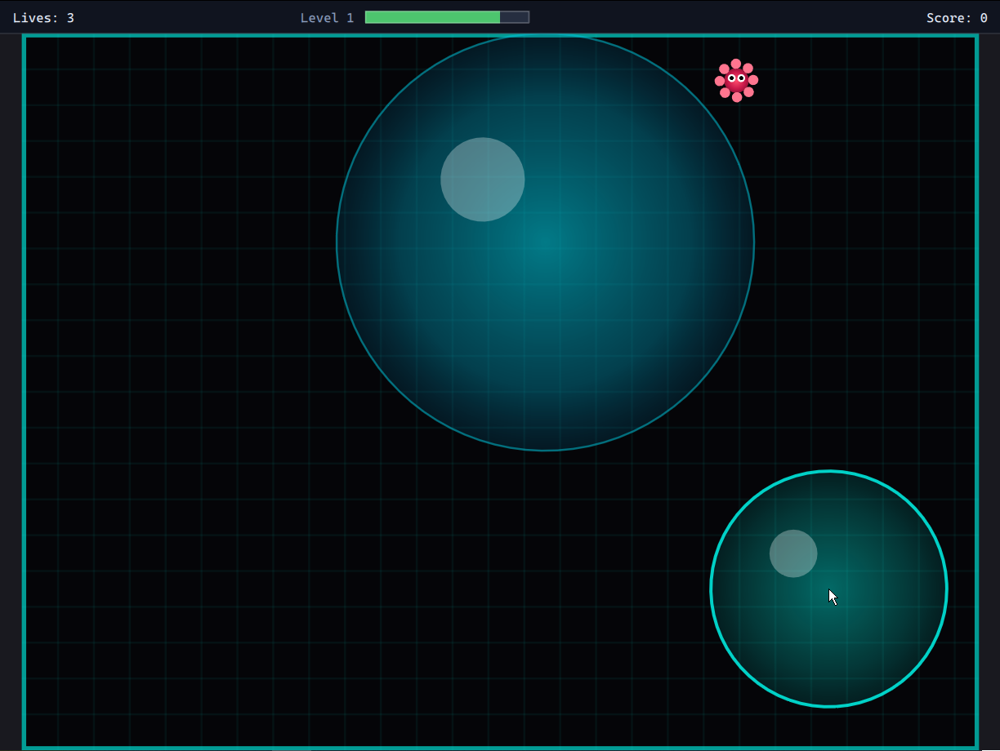

# Antidote

[](https://buymeacoffee.com/larsbrubaker)

[](https://larsbrubaker.github.io/antidote/)

[Live Demo](https://larsbrubaker.github.io/antidote/) · [Repository](https://github.com/larsbrubaker/antidote)

Bubble-trap virus puzzle game in Rust — rendered with [agg-gui](https://github.com/larsbrubaker/agg-gui), physics by [rapier2d](https://rapier.rs/). Runs natively (winit + wgpu) and in the browser (WebAssembly).

Held pointer grows an antidote bubble; bouncing viruses get trapped if they can't move for 3 seconds; lives, levels, and a best-score record persisted locally per device.

> Ported from the original TypeScript / Canvas 2D / Planck.js implementation, preserved under `gfg/` for read-only reference.

## Quick start

```bash
# Native
cargo run -p antidote-native
cargo install cargo-watch     # one-time install for watch mode
cargo dev                     # rebuilds and reruns antidote-native on changes

# WebAssembly
wasm-pack build antidote-wasm --target web --out-dir ../demo/public/pkg --no-typescript
cd demo && bun install && bun run dev
```

## Workspace layout

```
antidote-core/     # game logic + widget tree (target-agnostic; wasm32-clean)
antidote-native/   # winit + wgpu shell
antidote-wasm/     # cdylib wasm-bindgen shell
demo/              # TypeScript bundling shell for the WASM build
gfg/               # original TS/Canvas reference (read-only; not part of builds)
```

`antidote-core` is `wasm32`-clean — no `tokio`, no `dotenvy`, no `dirs`, no `winit`, no `wgpu`. Both shells inject a `BestScoreStore` impl (JSON file on native, `localStorage` in the browser).

## Persistence

The best total score ever achieved on this device is saved locally:

- Native: `${dirs::data_dir()}/antidote/best_score.json`
- WebAssembly: `localStorage["antidote_best_score"]`

No accounts, no network, no syncing across devices.

## Status

| Milestone | Description | State |
|-----------|-------------|-------|
| M1 | Skeleton | ✓ |
| M2 | Native gameplay MVP | ✓ |
| M3 | Menus, multiple levels, lives | ✓ |
| M4 | WASM build + GitHub Pages deploy | ✓ |
| M5 | Local best-score persistence | ✓ |

See [`antidote_todo.md`](antidote_todo.md) for the live punch list.

## License

MIT — see [LICENSE](LICENSE).

---

Part of the [rust-apps](https://github.com/larsbrubaker/rust-apps) suite — a collection of Rust graphics and geometry libraries by Lars Brubaker.
